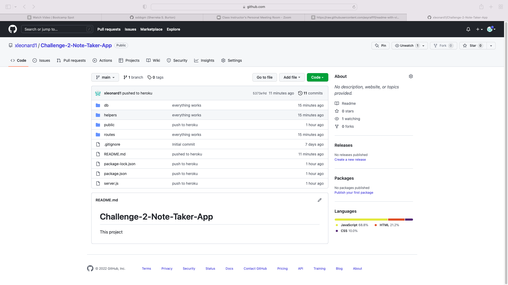

# Challenge-2-Note-Taker-App

This assignment required me to modify starter code to create an application called Note Taker that can be used to write and save notes on the backend. This application will use an Express.js back end and will save and retrieve note data from a JSON file. The application's front end was already created. I was required to build the back-end, connect the back-end to the front-end. and then deplot the entire application to Heroku

##### Table of Contents  
[Installation](##Installation)
[Installation](##Installation)  
[Visual](##Visual)  
[Contributors](##Contributors)  
[Contact](##Contact) 
[Deployment](##Deployment)  

## Installation

There is no installation necessary to run this application.

## Visual 

## Contributors

Xavier D. Leonard Jr.

## Contact
 xavier.lnrd@gmail.com

 ## Deployement

 Heroku: https://cryptic-plateau-61578.herokuapp.com/notes
 GitHub: https://github.com/xleonard1/Challenge-2-Note-Taker-App.git
 